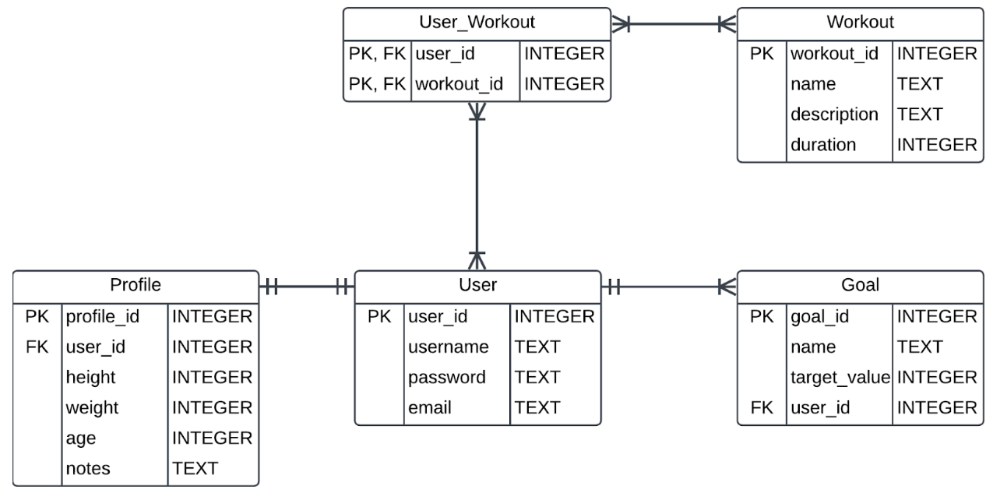

# Assignment #6 - Python Pulse

**TASK**: You have been hired to help manage the data for an up and coming fitness tracker app: Python Pulse. The app allows users to create profiles, track their workouts, set goals, and monitor their progress. The tables in the database are represented by the ER diagram below.



The tables have the following relationships:
- A user has one and only one profile.
- A user can create many goals. Each goal has one and only one user.
- A user can have multiple workouts and workouts can have multiple users.

## Grading Your Work
This assignment can grade itself! To setup the autograding, you should do the following:
1. Clone this file to your local machine using the command
```bash
git clone PASTE_URL_HERE
```
2. Open the downloaded file in your VS Code editor.
3. In the left hand sidebar, press the "Testing" menu represented by the picture of a flask.
4. Click "Configure Python Tests".
5. You'll have two options to select. Select **pytest**.
6. Select the folder where the tests live. You can simply select `. Root directory`.
7. You can now run the tests by pressing the play icon. A passing test will get a ✅ and a failing test will get a ❌.
8. Run the tests as you code and by the end it should be all ✅ if you have followed the specifications for this assignment!

## Unit Tests

### Table Creation and Data Insertion Tests
- `test_users_table_exists`: Tests that the `users` table exists in your `python_pulse.db`.
- `test_users_table_columns`: Tests that the `users` table has the correct columns (`user_id`, `username`, `password`, and `email`) and data types for each of these columns.
- `test_profiles_table_exists`: Tests that the `profiles` table exists in your `python_pulse.db`.
- `test_profiles_table_columns`: Tests that the `profiles` table has the correct columns (`profile_id`, `user_id`, `height`, `weight`, `age`, and `notes`) and data types for each of these columns.
- `test_users_data`: Tests that the sample user data has been inserted into the `users` table.
- `test_profiles_data`: Tests that the sample profile data has been inserted into the `profiles` table.
- `test_goals_table_exists`: Tests that the `goals` table exists in your `python_pulse.db`.
- `test_goals_table_columns`: Tests that the `goals` table has the correct columns (`goal_id`, `name`, `target_value`, and `user_id`) and data types for each of these columns.
- `test_goals_data`: Tests that the sample goal data has been inserted into the `goals` table.
- `test_workouts_table_exists`: Tests that the `workouts` table exists in your `python_pulse.db`.
- `test_user_workout_table_exists`: Tests that the `user_workout` table exists in your `python_pulse.db`.
- `test_workouts_table_columns`: Tests that the workouts table has the correct columns (`workout_id`, `name`, `description`, and `duration`) and data types for each of these columns.
- `test_user_workout_table_columns`: Tests that the `user_workout` table has the correct columns (`user_id` and `workout_id`) and data types for each of these columns.
- `test_workouts_data`: Tests that the sample workout data has been inserted into the `workouts` table.
- `test_user_workout_data`: Tests that the sample workout data has been inserted into the `user_workout` table.

### SQL Association Tests
- `test_profiles_foreign_key`: Tests that the `profiles` table has a foreign key assigned to `user_id` and that it references the `users` table.
- `test_goals_foreign_key`: Tests that the `goals` table has a foreign key assigned to `user_id` and that it references the `users` table.
- `test_user_workout_foreign_keys`: Tests that the `user_workout` table has correct foreign keys (`user_id` and `workout_id`) that reference the users and workouts tables.